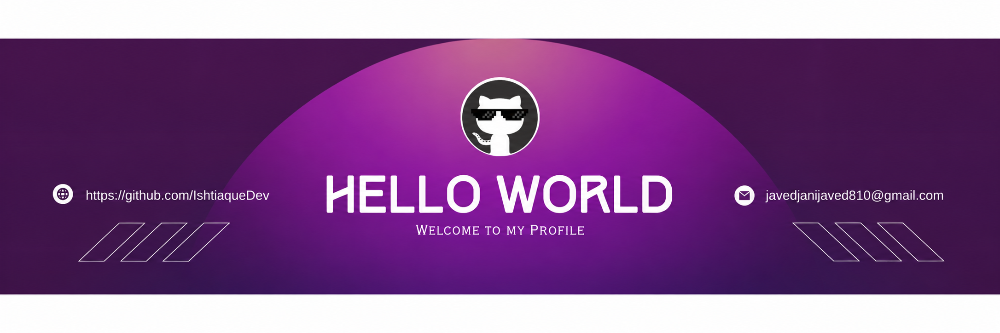

<<<<<<< HEAD
<!--Banner-->

<!--Night Owl image-->

  

<!--Header Name-->
#  ɪ'ᴍ ɪsʜᴛɪᴀǫᴜᴇ ᴀʟɪ!

*Full Stack Web Developer | MERN Stack Developer | Java Developer*

 

<!--Start Intro-->

I am a Computer Science student and Full Stack Developer passionate about building real-world web applications. 
I specialize in MERN Stack development, backend engineering, database design, and continuously improving my problem-solving skills through practical projects.

- 🎓 BS Computer Science Student at Sukkur IBA University Khairpur Campus
- 💻 Full Stack Web Developer (MERN Stack)
- ⚙️ Backend Development Enthusiast
- ☕ Java Developer (Desktop Applications & OOP)
- 🤖 Exploring Artificial Intelligence and AI-powered applications
- 🚀 Building real-world projects to improve engineering skills
- 🌱 Always learning and improving every day

<!--End Intro-->

<!--Profile Count Badge-->

  

---

<h2 align="center">🚀 Tᴇᴄʜ Sᴛᴀᴄᴋ & Cᴜʀʀᴇɴᴛ Lᴇᴀʀɴɪɴɢ</h2>

<h3 align="left">Current Learning</h3>

<ul align="left">
<li>Advanced Backend Development with Node.js & Express</li>
<li>Database Design and MongoDB Relationships</li>
<li>Authentication and Authorization Systems</li>
<li>React.js and Modern Frontend Development</li>
<li>Artificial Intelligence and AI Application Development</li>
<li>Data Structures and Algorithms in Java</li>
</ul>

<h3 align="left">Computer Science Fundamentals</h3>

<ul align="left">
<li>Data Structures and Algorithms</li>
<li>Object Oriented Programming</li>
<li>Database Management Systems</li>
<li>Operating Systems</li>
<li>Computer Networks</li>
<li>Software Engineering Principles</li>
</ul>

 

<!--Github stats-->
<h2 align="center">📊 Gɪᴛʜᴜʙ Sᴛᴀᴛs 📊</h2>

<table width="100%">
<tr>

<td width="50%">

</td>

<td width="50%">

</td>

</tr>
</table>

---

<!--Projects Section-->

<h2 align="center">🚀 Pʀᴏᴊᴇᴄᴛs</h2>

### 🌍 WanderLust - Full Stack Listing Platform
A full-stack Airbnb-inspired application built using MERN technologies.

**Features:**
- User Authentication
- CRUD Operations
- Reviews System
- MongoDB Relationships
- Express Backend
- Responsive UI

### 💬 Chat Application
A real-time style chat application built while learning backend development.

**Tech:**
- Node.js
- Express.js
- MongoDB
- EJS

### 📝 Blogging Website
A blogging platform focusing on backend architecture and database management.

### 🤖 The Tiebreaker - AI Decision Making App
An AI-powered application built using Google AI Studio that helps users analyze choices by comparing advantages and disadvantages.

### 🎯 Other Projects

- Java Desktop Applications
- Database Relationship Learning Projects
- JavaScript Quiz Application
- Mini Applications for Practice

---

<!--Contribution Graph-->

<h2 align="center">📈 Cᴏɴᴛʀɪʙᴜᴛɪᴏɴ Gʀᴀᴘʜ 📈</h2>

---

<h2 align="center">🌟 Tʜᴏᴜɢʜᴛ Oғ Tʜᴇ Dᴀʏ 🌟</h2>

---

<!--Contact Section-->

<h2 align="center">🤝 Cᴏɴɴᴇᴄᴛ Wɪᴛʜ Mᴇ 🤝</h2>

 

<!--Footer-->

=======
